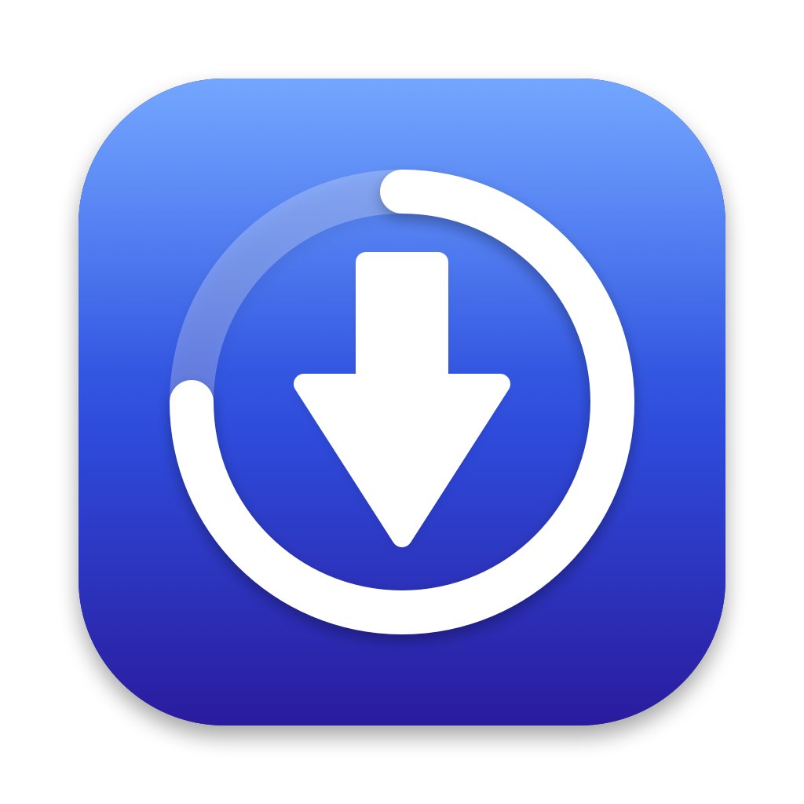

<p align="center">
  
</p>

<h1 align="center">ADV Downloader</h1>

<p align="center">
  A native macOS app for downloading video and audio from the web — guided for everyday use, powerful when you need it.
</p>

<p align="center">
  
  
  
  
</p>

---

## Table of contents

- [Overview](#overview)
- [Features](#features)
- [Requirements](#requirements)
- [Getting started](#getting-started)
- [Using the app](#using-the-app)
  - [Downloader](#downloader)
  - [Browsing lists of videos](#browsing-lists-of-videos)
  - [VPN through your own server](#vpn-through-your-own-server)
  - [Browser (Beta)](#browser-beta)
- [Settings and data locations](#settings-and-data-locations)
- [Privacy and security](#privacy-and-security)
- [Development](#development)
- [Troubleshooting](#troubleshooting)
- [Known limitations](#known-limitations)
- [Legal](#legal)
- [License](#license)

## Overview

ADV Downloader is a macOS application built with SwiftUI. It wraps [`yt-dlp`](https://github.com/yt-dlp/yt-dlp) and [`ffmpeg`](https://ffmpeg.org) in a simple, guided interface: paste a link (or search), pick a quality, and download. Power users can switch to **Advanced** mode to control formats, post-processing, subtitles, networking and the exact command line.

Two additions set it apart from a plain `yt-dlp` front end:

- **A private network path.** Route the downloader and the built-in browser through an SSH tunnel to a server you control, without changing the rest of your Mac's network.
- **An experimental in-app browser** with ad blocking, per-site muting and direct file downloads.

## Features

**Downloading**
- Paste a link and pick from a simplified quality list (video up to 2160p, audio 320/256/192/128 kbps) with a recommended option highlighted.
- Automatic analysis when a link is pasted, with estimated file sizes.
- Download queue with progress, speed and ETA, pause/resume/cancel/retry, 1–5 simultaneous downloads, and persistence across launches.
- Clipboard suggestion ("Use the link from your clipboard?"), completion toast and optional macOS notifications.
- Plain-language error messages instead of raw `yt-dlp` output.
- Menu bar companion for quick downloads.

**Finding videos**
- Type a search phrase, or paste a YouTube channel, playlist or search link, to get a browsable grid of videos. Click one to choose its quality.
- Paginated loading ("Load more") with thumbnails, duration, channel and view counts.

**Advanced mode**
- Tabs for Format, Post-Processing, Subtitles, Network, Filesystem and Advanced options.
- Live command-line preview, presets, and a log console.

**VPN (SSH tunnel)**
- One-switch tunnel through your own SSH server, used only by this app.
- Key-based or password login; secrets are stored in the macOS Keychain.
- Fail-closed behaviour: while the VPN switch is on but not connected, nothing is sent over your normal network.

**Browser (Beta)**
- Browse any website inside the app; send video pages to the downloader with one click.
- Direct file downloads (zip, pdf, media files and other attachments).
- Ad and tracker blocking powered by EasyList and EasyPrivacy, plus YouTube-specific handling.
- Site muting with a "mute everything by default" mode.
- One-click clear (blank page, cookies and site data).

**Desktop polish**
- Light, dark and system appearance.
- Window limited between the app's normal size and the visible desktop; double-click the title bar to fill the desktop and again to restore.

## Requirements

| Component | Requirement |
|---|---|
| Operating system | macOS 14 (Sonoma) or later |
| Build toolchain | Xcode with Swift 6 |
| [`yt-dlp`](https://github.com/yt-dlp/yt-dlp) | Required (the app can guide installation) |
| [`ffmpeg`](https://ffmpeg.org) | Required for merging and audio extraction |
| VPN feature | An SSH server you control, with TCP forwarding enabled |

Install the tools with Homebrew if you prefer:

```bash
brew install yt-dlp ffmpeg
```

## Getting started

### Run from source

```bash
git clone <repository-url>
cd Y-Downloader
./scripts/run-app.sh
```

The script builds the project, assembles `ADV Downloader.app` in `.build/`, signs it ad hoc and launches it. Running it as a real `.app` bundle matters: keyboard shortcuts, notifications and the Dock icon only work properly that way.

On first launch the **Setup Assistant** checks for `yt-dlp` and `ffmpeg` and helps you install what is missing. You can also set custom paths under **Settings → Binaries**.

### Build with Xcode

The repository ships with an Xcode project generated from [`project.yml`](project.yml) ([XcodeGen](https://github.com/yonaskolb/XcodeGen)). To regenerate it after changing the spec:

```bash
brew install xcodegen
xcodegen generate
```

## Using the app

### Downloader

1. Paste a video link into the box (or type a search phrase). Analysis starts automatically.
2. Choose **Video** or **Audio only**, then click **Download** on the quality you want.
3. Follow progress in the Downloads panel. When finished, open the file or its folder from the toast or the panel.

Switch between **Simple** and **Advanced** with the toggle in the toolbar (⇧⌘M). Keyboard shortcuts: **⌘D** start a download, **⇧⌘A** analyze, **⇧⌘V** paste a URL.

### Browsing lists of videos

Anything that is not a single video link opens a list instead:

| You enter | Result |
|---|---|
| `swift tutorial` | Search results |
| `youtube.com/@channel` | The channel's videos (or `/shorts`, `/streams`, `/playlists`) |
| `youtube.com/playlist?list=…` | The playlist's videos |
| `youtube.com/results?search_query=…` | Search results |

Click any card to open the quality picker; use **Back to list** to return without reloading. In Advanced mode the list appears under the link box.

> The YouTube home page and personalised recommendations require a signed-in account and cannot be listed this way. Use the [Browser](#browser-beta) tab to browse them.

### VPN through your own server

The VPN feature runs `ssh -D` as a child process, creating a local SOCKS5 proxy that exits through your server. Only this app's traffic uses it.

**Server requirements:** SSH access, and `AllowTcpForwarding yes` in `sshd_config` (the default on most systems).

**Setup**

1. Open **Settings → VPN** (or **Settings → Set up…** in Simple mode).
2. Enter the server address, SSH port and username.
3. Choose a login method:
   - **SSH Key** — paste the full private key (`-----BEGIN … PRIVATE KEY-----` to `-----END …-----`), plus its passphrase if it has one.
   - **Password** — enter your SSH password.
4. Click **Test connection**. On first use you are asked to confirm the server's fingerprint.
5. Turn on **Connect by VPN** from the **VPN** button in the toolbar.

**Behaviour**

- Analysis, downloads and the built-in browser use `socks5h://127.0.0.1:<port>` (default port 1080), so DNS is resolved by the server too.
- When connected, the app shows the exit IP address of your server.
- If the tunnel drops, the app retries up to three times. While the switch is on and the tunnel is down, requests fail with a clear message instead of leaking onto your normal network.
- Private keys, passphrases and passwords are stored in the Keychain. A key is written to a temporary file (mode `600`) only while connecting and is deleted as soon as login completes.
- Host keys are pinned in the app's own `known_hosts`. If a server's fingerprint changes, the connection is refused until you choose **Forget server**.

### Browser (Beta)

Select **Browser (Beta)** in the toolbar segmented control. The browser starts on a blank page.

| Control | Purpose |
|---|---|
| Address bar | Enter a URL or a search phrase (searches use DuckDuckGo) |
| Shield | Turn ad and tracker blocking on or off |
| Speaker | Mute or unmute the current site; the arrow opens "Mute all sites by default" |
| ✕ | Clear the browser: blank page, cookies, cache and site data |
| Download button | **Download video** (video pages), **Show as list** (channels, playlists, searches) or **Try to download** (other sites) |

Direct file links (attachments, archives and other non-displayable content) download straight into your download folder, with progress shown under the page.

**Ad blocking**

The app downloads [EasyList](https://easylist.to) and [EasyPrivacy](https://easylist.to/easylist/easyprivacy.txt) on first use, converts them to WebKit content-blocker rules and refreshes them weekly. A small built-in rule set and a YouTube-specific script (which removes ad data from player responses) are applied on top. Hover over the shield to see the filter status.

**Muting**

Every site starts muted by default. Click the speaker to unmute a site; the choice is remembered per site.

The browser is experimental. It is gated by **Settings → General → Experimental: Browser tab** and can be hidden.

## Settings and data locations

| Item | Location |
|---|---|
| Default download folder | `~/Downloads/Y-Downloader` (change in Settings) |
| App data (`yt-dlp` binary, queue, presets, ad filter lists, pinned SSH host keys) | `~/Library/Application Support/Y-Downloader/` |
| VPN secrets (key, passphrase, password) | macOS Keychain, service `com.ydownloader.vpn` |
| Preferences | `UserDefaults` (`com.ydownloader.Y-Downloader`) |
| Browser cookies and site data | `~/Library/WebKit/com.ydownloader.Y-Downloader` |

## Privacy and security

- **No telemetry.** The app contains no analytics or tracking of its own.
- **Network activity** is limited to: the sites you download from or browse, the `yt-dlp` updater (if enabled), the ad filter lists on `easylist.to`, and — when the VPN is connected — a request to `api.ipify.org` through the tunnel to display your exit IP.
- The filter-list download does not go through the VPN tunnel.
- The VPN is only as private as the server you point it at; your server operator can see the traffic that exits through it.
- The app is not sandboxed (it runs user-installed binaries). Review the entitlements in [`Y-Downloader.entitlements`](Y-Downloader/Resources/Y-Downloader.entitlements) before distributing.
- The site-mute feature calls an internal WebKit selector (`_setPageMuted:`). It is looked up at runtime and the button disables itself if it is unavailable. Replace it with a public mechanism before any App Store submission.

## Development

### Project layout

```text
Y-Downloader/
├── Y-Downloader/            Application sources
│   ├── App/                 App entry point, global state, window sizing
│   ├── Models/              Download options, video info, lists, presets
│   ├── Services/            yt-dlp service, queue, SSH tunnel, Keychain, helpers
│   ├── Stores/              Settings and VPN settings
│   ├── Browser/             In-app browser, ad blocker, filter lists
│   ├── Views/               SwiftUI views (Simple, Advanced tabs, VPN, Settings)
│   ├── Utilities/           Process runner
│   └── Resources/           Info.plist, entitlements, app icon
├── Tests/                   Unit and live tests
├── scripts/                 run-app.sh, icon generation
├── design/                  Icon source artwork
├── docs/                    PRD and TRD
├── Package.swift            Swift Package Manager manifest
└── project.yml              XcodeGen spec for the Xcode project
```

### Build and test

```bash
swift build
swift test --filter VPNTests
swift test --filter ListingTests
swift test --filter BrowserTests
```

Run a subset with `--filter`; some suites touch the network. The live suite needs the real `yt-dlp` and an internet connection:

```bash
LIVE=1 swift test --filter LiveTests
```

The EasyList conversion test is skipped unless you point it at a local copy of the list:

```bash
YDL_EASYLIST=/path/to/easylist.txt swift test --filter testEasyListConvertsAndCompiles
```

### Regenerating the app icon

```bash
swift scripts/make-icon.swift      # draws design/AppIcon-1024.png
./scripts/build-icon.sh            # builds Y-Downloader/Resources/AppIcon.icns
```

### Dependencies

| Package | Use |
|---|---|
| [AdguardTeam/SafariConverterLib](https://github.com/AdguardTeam/SafariConverterLib) | Converts EasyList/EasyPrivacy rules to WebKit content-blocker JSON |
| [gumob/PunycodeSwift](https://github.com/gumob/PunycodeSwift), [ameshkov/swift-psl](https://github.com/ameshkov/swift-psl) | Transitive dependencies of the converter |

> SwiftPM resource bundles (for example `swift-psl_PublicSuffixList.bundle`) must be present inside the application bundle at `Contents/Resources`. `scripts/run-app.sh` copies them automatically; do the same in any custom packaging step, or the app will crash at launch when it first converts the filter lists.

## Troubleshooting

| Symptom | What to try |
|---|---|
| "yt-dlp binary not found" | Run the Setup Assistant, or set the path in **Settings → Binaries** |
| Merging or audio extraction fails | Install `ffmpeg` (`brew install ffmpeg`) and set its path in **Settings → Binaries** |
| VPN: "Login failed" | Check the username and the key or password. If the key has a passphrase, enter it too |
| VPN: "The server's identity changed" | Only continue if you reinstalled the server, then use **Forget server** |
| VPN: connected but traffic does not pass | The server may disable TCP forwarding (`AllowTcpForwarding`) |
| Downloads fail with "VPN is turned on but not connected" | Reconnect the VPN or turn the switch off |
| A site breaks in the browser | Turn the shield off for that session; some sites do not tolerate content blocking |
| Ads still appear in the browser | The built-in blocking is rule-based and cannot match every ad. Hover over the shield to confirm the filter lists are active |
| App crashes at launch after a custom build | Make sure the `.bundle` resource folders were copied into `Contents/Resources` |

## Known limitations

- List browsing recognises YouTube channels, playlists and searches. Other sites are treated as single-video links.
- The YouTube home feed cannot be listed without a signed-in session.
- Ad blocking uses WebKit content-blocker rules; it is not as thorough as a full browser-level blocker, and YouTube may change its player at any time.
- The in-app browser is experimental: no tabs, bookmarks or history, and no extension support.
- DRM-protected streams cannot be downloaded.
- macOS only.

## Legal

ADV Downloader is a general-purpose tool. You are responsible for complying with the terms of service of the sites you use and with copyright law in your jurisdiction. Only download content you have the right to save.

## License

ADV Downloader is free software, released under the **GNU General Public License v3.0**. See [LICENSE](LICENSE) for the full text.

Copyright © 2026 ilham-fauzi.

In short: you may use, study, modify and redistribute this software, provided that any distributed version (modified or not) is also licensed under GPL-3.0 and its source code is made available. The program comes with no warranty.

Third-party components keep their own licenses: `yt-dlp` and `ffmpeg` are separate programs that the app runs, not parts of it; [SafariConverterLib](https://github.com/AdguardTeam/SafariConverterLib) (GPL-3.0), PunycodeSwift and swift-psl (MIT) are linked into the app.
